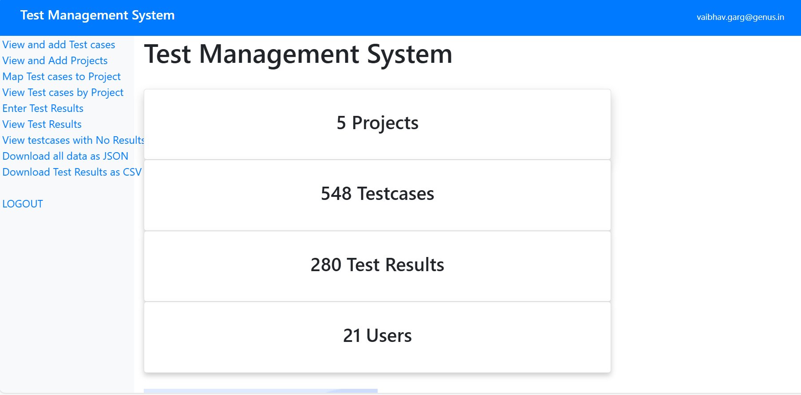
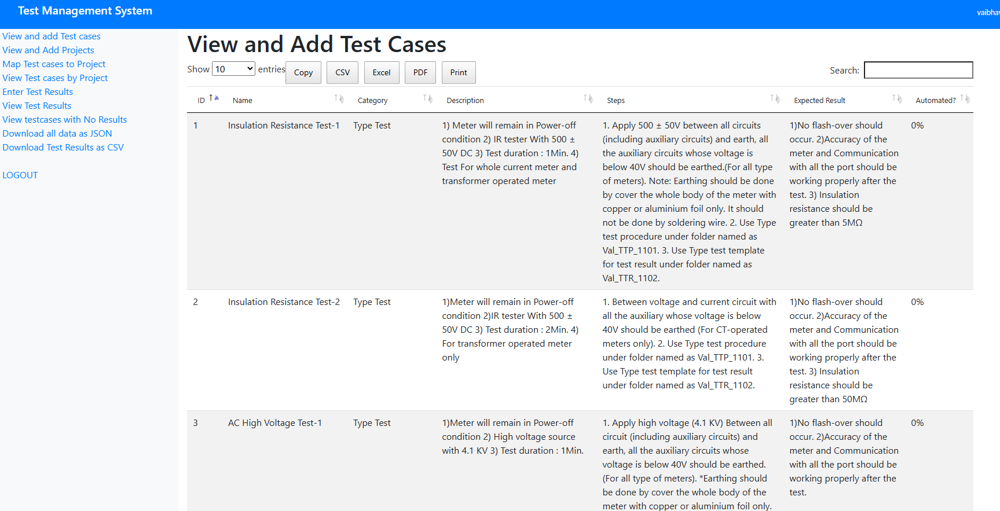
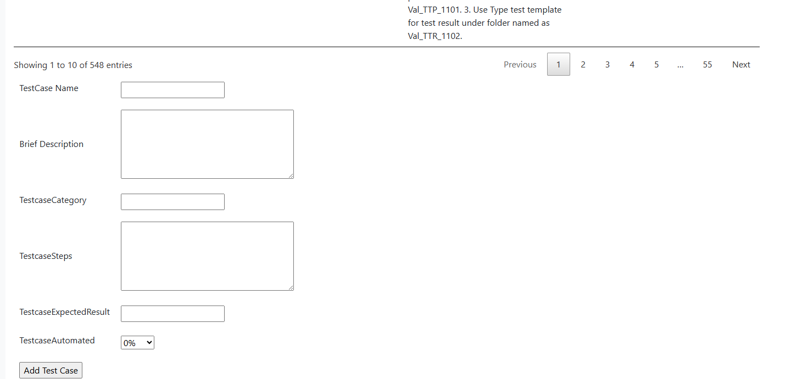
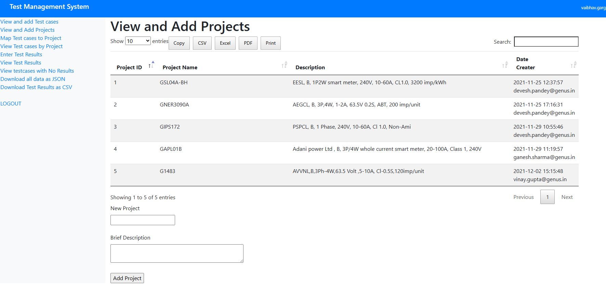
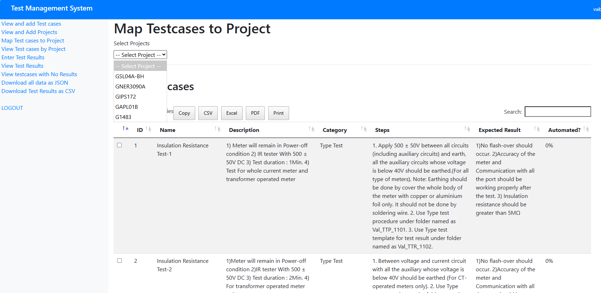
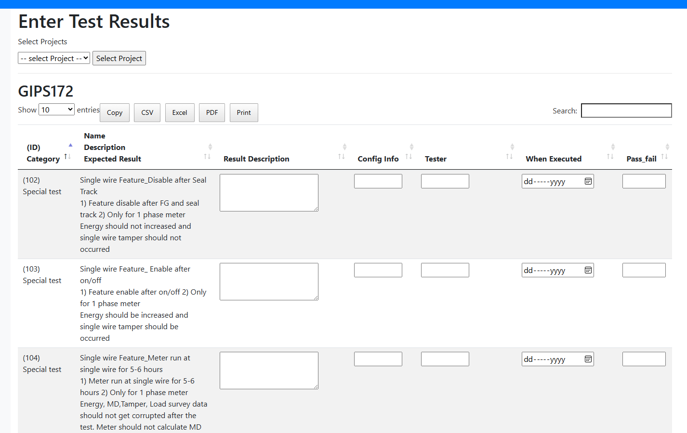
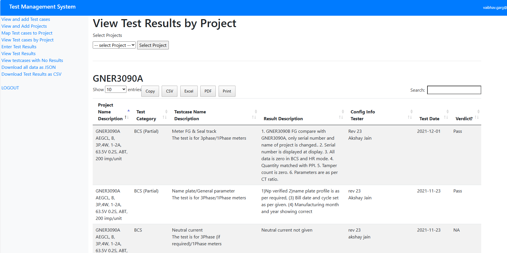
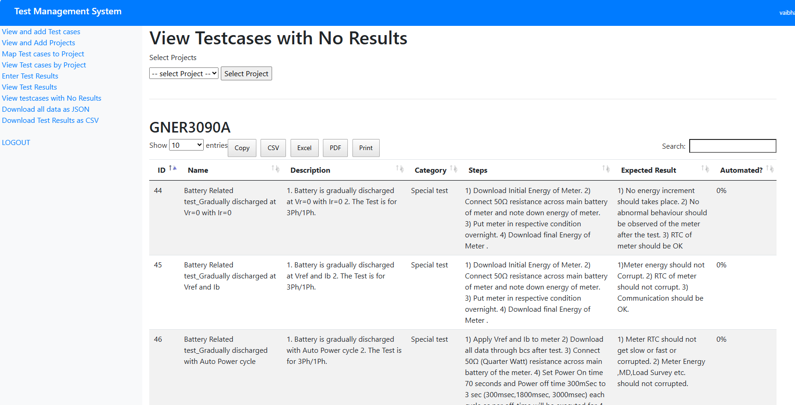

# Test Case Management System (TMS)

## Overview
The Test Case Management System (TMS) is a web-based application designed to manage test cases, projects, and their relationships. It allows users to map test cases to projects, execute tests, record results, and generate various reports. The application also includes an admin interface for user management.

---

## Features

### 1. **User Authentication**
- **Login**: Users can log in using their email and password.
- **Admin Access**: Admin users have additional privileges, such as managing users.
- **Logout**: Users can securely log out of the system.

---

### 2. **Test Case Management**
- **Add Test Cases**: Users can create new test cases by providing:
  - Name
  - Test Category
  - Description
  - Steps
  - Expected Result
  - Whether the test is automated
- **View Test Cases**: Users can view all test cases in the system.

<!-- image View and Add Test cases at 002addtc.png-->

---

### 3. **Project Management**
- **Add Projects**: Users can create new projects by providing:
  - Name
  - Description
- **View Projects**: Users can view all projects in the system.

---

### 4. **Mapping Test Cases to Projects**
- **Map Test Cases**: Users can map test cases to specific projects.
- **View Mappings**: Users can view the test cases mapped to each project.

---

### 5. **Test Execution and Results**
- **Add Test Results**: Users can record the results of test executions, including:
  - Result Description
  - Configuration Information
  - Tester Name
  - Execution Date
  - Pass/Fail Status
  
- **View Test Results**: Users can view test results for specific projects or test cases.

---

### 6. **Reporting**
- **Test Results by Project**: Generate reports of test results for a specific project.

- **Test Cases Without Results**: Identify test cases that have not been executed or do not have results.

- **Download All Data**: Export all data (projects, test cases, mappings, and test results) as a JSON file.
- **Download Test Results**: Export test results as a CSV file.

---

### 7. **Admin Features**
- **User Management**:
  - Add New Users: Admins can create new user accounts.
  - Update User Passwords: Admins can reset passwords for existing users.
  - View All Users: Admins can view a list of all registered users.

---

## Workflow

### 1. **Login**
- Users log in using their email and password.
- Admin users are redirected to the "New User" page, while regular users are redirected to the "About" page.

---

### 2. **Test Case Management**
- Navigate to the "Test Cases" page to add or view test cases.
- Fill in the required fields to create a new test case.

---

### 3. **Project Management**
- Navigate to the "Projects" page to add or view projects.
- Fill in the required fields to create a new project.

---

### 4. **Mapping Test Cases to Projects**
- Navigate to the "Map Test Cases to Projects" page.
- Select a project and choose test cases to map to it.

---

### 5. **Test Execution and Results**
- Navigate to the "Test Results" page.
- Select a project and add test results for its mapped test cases.

---

### 6. **Reporting**
- Use the "Test Results by Project" page to view detailed test results for a specific project.
- Use the "No Results" page to identify test cases without results.
- Use the "Download All" or "Download Results" options to export data.

---

### 7. **Admin Workflow**
- Admin users can navigate to the "New User" page to manage user accounts.
- Admins can add new users or update passwords for existing users.

---

